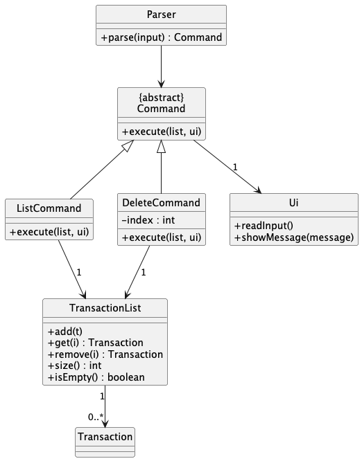
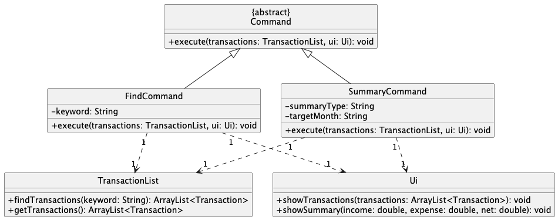
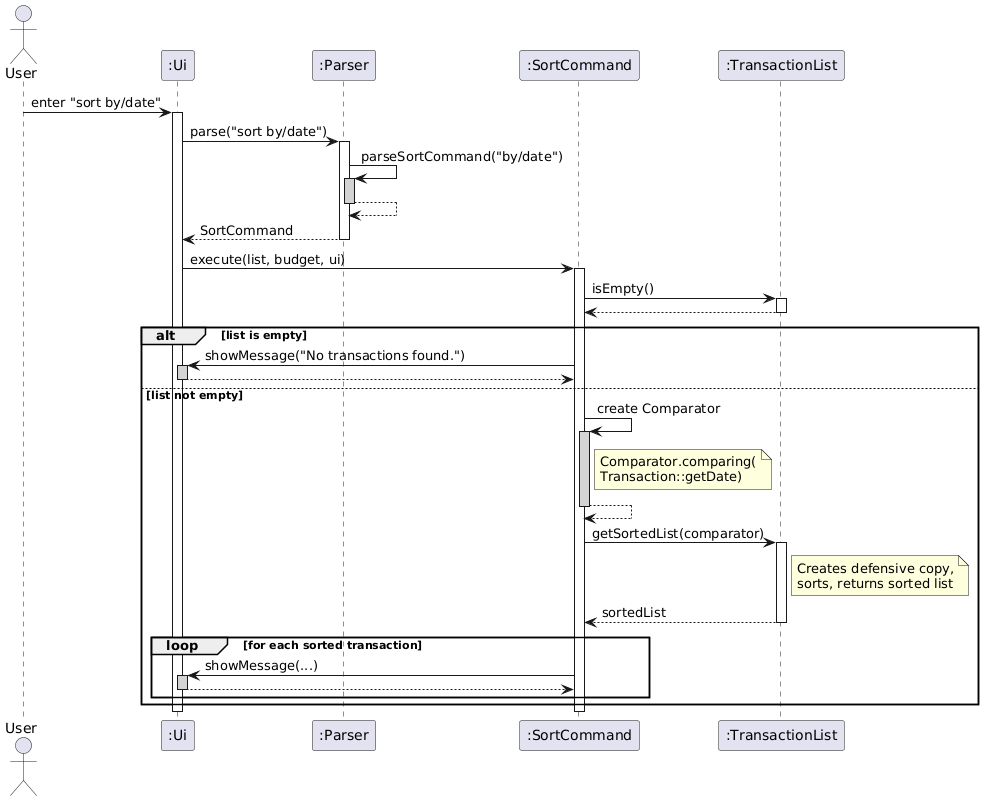
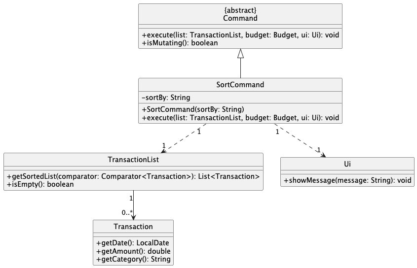

# Developer Guide

## Acknowledgements

{list here sources of all reused/adapted ideas, code, documentation, and third-party libraries -- include links to the original source as well}

## Design & implementation

# Design

## Architecture

(Overall system architecture diagram and explanation)

## Components
### Parser
### Command
### Ui
### TransactionList / Storage
# Implementation

## List and Delete Transaction Feature

### Overview
The list and delete transaction features allow users to manage their transactions stored in the application.
The `list` command displays all recorded transactions in a numbered format, while the `delete` command removes a transaction based on its index.
These features improve usability by allowing users to review and remove transactions easily.

### Architecture and Flow
When a user enters a command, the input is first handled by the `Ui` component, which reads the input and passes it to the `Parser`.
The `Parser` then interprets the input and creates the appropriate `Command` object (`ListCommand` or `DeleteCommand`).
The command is executed using the `TransactionList` to retrieve or remove transactions, and the result is displayed to the user through the `Ui`.

### Sequence Diagram for List Command

### Listing Transactions
The `list` command is implemented using the `ListCommand` class.
When executed, the command checks whether the transaction list is empty using the `isEmpty()` method.
If the list is not empty, it iterates through the transactions using the `size()` and `get(int i)` methods and displays them in a numbered format.

### Sequence Diagram for Delete Command

### Deleting Transactions
The `delete` command is implemented using the `DeleteCommand` class.
The `Parser` extracts the index provided by the user and passes it to the `DeleteCommand`.
The `DeleteCommand` then removes the corresponding transaction from `TransactionList` using the `remove(int i)` method and displays a confirmation message.

### Class Diagram

### Design Considerations
This feature uses a command-based architecture to ensure separation of concerns.
The `Parser` is responsible only for parsing user input, while each command class is responsible for executing its own logic.
The `TransactionList` class manages the storage of transactions, which improves modularity and maintainability.
Assertions and logging are used in `TransactionList` as part of defensive programming to detect invalid operations and to record important actions such as adding or removing transactions.

### Alternatives Considered
One alternative was to place all command logic inside the `Parser` class using conditional statements.
However, this approach would make the `Parser` class too large and difficult to maintain as more commands are added.
Another alternative was to allow the `Ui` class to directly modify the transaction list, but this would reduce modularity and violate separation of concerns.
The chosen design using separate command classes was preferred because it improves extensibility and maintainability.

### Future Improvements
Possible future improvements include allowing deletion of multiple transactions at once, supporting filtered list views, and adding an undo feature to restore deleted transactions

---

## Find and Summary Transaction Features

### Overview
The `find` and `summary` features allow users to draw meaningful insights from their recorded transactions.
The `find` command locates specific transactions based on keyword matching, allowing users to search for distinct transactions or categories. 
The `summary` command calculates and displays the overall statistics (eg. total expense) for the user to see at a glance.

### Architecture and Flow
Similar to the broader application architecture, these features rely on the interaction between the `Parser`, `Command`, `TransactionList`, and `Ui` components.
1. The `Parser` receives raw input (e.g., `find food` or `summary`) and instantiates either a `FindCommand` containing the target keyword, or a `SummaryCommand`.
2. Upon calling `execute()`, the respective command interacts with the `TransactionList` to either filter for matches or aggregate financial data.
3. The computed results are formatted and printed to the user via the `Ui`.

### Finding Transactions
The `find` command is encapsulated within the `FindCommand` class. 
During execution, the method iterates through the current list, comparing the target keyword against the description of each transaction.

#### Sequence Diagram for Find Command
The following sequence diagram illustrates the precise object interactions when a user searches for a keyword.

### Summarizing Transactions
The `summary` command is handled by the `SummaryCommand` class. 
It performs computations over the list of transactions. 
It iterates through the entire `TransactionList`, categorising each entry as either an Income or an Expense, and sums the respective totals before calculating the net balance.

#### Sequence Diagram for Summary Command
The following sequence diagram illustrates the interactions when a user wants to see a summary of their transactions.

### Class Diagram
Both commands adhere to the application's Command pattern structure. The diagram below shows how `FindCommand` and `SummaryCommand` inherit from the abstract `Command` class and depend on `TransactionList` and `Ui`.

### Design Considerations
* **Case-Insensitive Searching:** For the `find` feature, it was decided that keyword matching should be case-insensitive (e.g., searching "food" returns "Food" and "FOOD"). This greatly enhances user experience, as users do not need to remember the exact capitalization of their previous entries.
* **Stream-Based Indexing:** A major design consideration was how to display matching transactions alongside their original indices from the main list. Instead of iterating through the list and keeping a separate counter, IntStream.range(0, list.size()) was used.

### Alternatives Considered
* **Alternative for Summary:** We considered caching the total income and expense values inside `TransactionList`, updating them dynamically every time an item is added or deleted. While this makes the `summary` command run in O(1) time, it heavily complicates the `add` and `delete` operations and introduces state-synchronization bugs. The O(N) calculation upon execution was chosen for stability and simplicity.

### Future Improvements
* **Time-Bound Summaries:** Upgrading the `summary` command to accept date parameters, allowing users to see summaries for specific months or weeks (e.g., `summary /from 2026-01-01 /to 2026-01-31`).

---

## Sort Transaction Feature

### Overview
The `sort` command allows users to view their transactions ordered by date, amount, or category,
without modifying the underlying list order. It is a read-only operation that creates a temporary
sorted copy purely for display.

### Architecture and Flow
When the user enters a sort command (e.g., `sort by/date`), the input is passed from the `Ui`
to the `Parser`. The `Parser` calls `parseSortCommand()`, which validates the `by/` prefix and
the criteria string. A `SortCommand` is created with the validated criteria and returned to the
main loop. During execution, `SortCommand` constructs an appropriate `Comparator<Transaction>`,
calls `TransactionList.getSortedList(comparator)` to obtain a sorted defensive copy, and displays
the results through the `Ui`.

### Sequence Diagram
The following sequence diagram illustrates the interaction when a user sorts transactions by date.

### Implementation Details
- **Parsing:** `Parser.parseSortCommand()` validates the `by/` prefix and checks the criteria
  against the three accepted values: `"date"`, `"amount"`, and `"category"`. Any other value
  throws a `MoneyBagProMaxException`.
- **Comparator selection:** `SortCommand.execute()` uses a `switch` statement to build the
  appropriate comparator:
  - `date` — `Comparator.comparing(Transaction::getDate)` (ascending, earliest first)
  - `amount` — `Comparator.comparingDouble(Transaction::getAmount).reversed()` (descending,
    largest first)
  - `category` — `Comparator.comparing(Transaction::getCategory, String.CASE_INSENSITIVE_ORDER)`
    (alphabetical, case-insensitive)
- **Non-mutating:** `TransactionList.getSortedList()` copies the list into a new `ArrayList`,
  sorts the copy using `Collections.sort()`, and returns it. The original `TransactionList` is
  never modified. `SortCommand` does not override `isMutating()`, so it inherits `false` from
  the base `Command` class — no auto-save is triggered after execution.

### Class Diagram

### Design Considerations
- **Non-mutating design:** The sort command deliberately returns a sorted copy rather than sorting
  the list in place. This preserves the user's insertion order and avoids corrupting the indices
  stored by `UndoRedoManager`. If sort modified the list order, previously recorded undo/redo
  indices would point to the wrong transactions, breaking the undo/redo feature.
- **Leveraging Java standard library:** Using `Comparator` method references and
  `Comparator.comparing()` avoids hand-written comparison logic, which is verbose and prone to
  sign errors. The standard library comparators are well-tested and handle edge cases (e.g., null
  dates) more robustly.
- **`isMutating()` returns false:** Because the original list is unchanged, no storage save is
  needed after sort. This is an intentional contract with the main loop — sort is a view command,
  not a data command.

### Alternatives Considered
- **In-place sort with an "unsort" command:** Sorting the actual list is simpler to implement but
  destroys the insertion order that `UndoRedoManager` relies on. Providing an "unsort" command to
  restore original order would require persisting the original order separately, significantly
  increasing complexity. The defensive-copy approach was chosen for simplicity and correctness.
- **Caching the sorted result:** Storing the last sort result in `TransactionList` could avoid
  re-sorting on repeated calls. However, any add/delete/edit operation would stale the cache,
  requiring cache-invalidation logic. Since the list is small for a personal finance app and
  sorting is O(n log n), this optimization was deemed unnecessary.
- **Persistent sort order:** An alternative was to make sort permanently reorder the list and
  save to storage. This was rejected because users expect sort to be a display-only operation,
  not a data mutation. Making it persistent would also conflict with undo/redo index semantics.

### Future Improvements
- Support multi-key sorting (e.g., `sort by/category by/date` to sort by category then date
  within each category).
- Add an ascending/descending toggle (e.g., `sort by/amount asc`).
- Display original list indices alongside sorted results so users can reference them for
  subsequent `delete` or `edit` commands.

---

## Product scope
### Target user profile

{Describe the target user profile}

### Value proposition

{Describe the value proposition: what problem does it solve?}

## User Stories

|Version| As a ... | I want to ... | So that I can ...|
|--------|----------|---------------|------------------|
|v1.0|new user|see usage instructions|refer to them when I forget how to use the application|
|v2.0|user|find a to-do item by name|locate a to-do without having to go through the entire list|

## Non-Functional Requirements

{Give non-functional requirements}

## Glossary

* *glossary item* - Definition

## Instructions for manual testing

{Give instructions on how to do a manual product testing e.g., how to load sample data to be used for testing}
